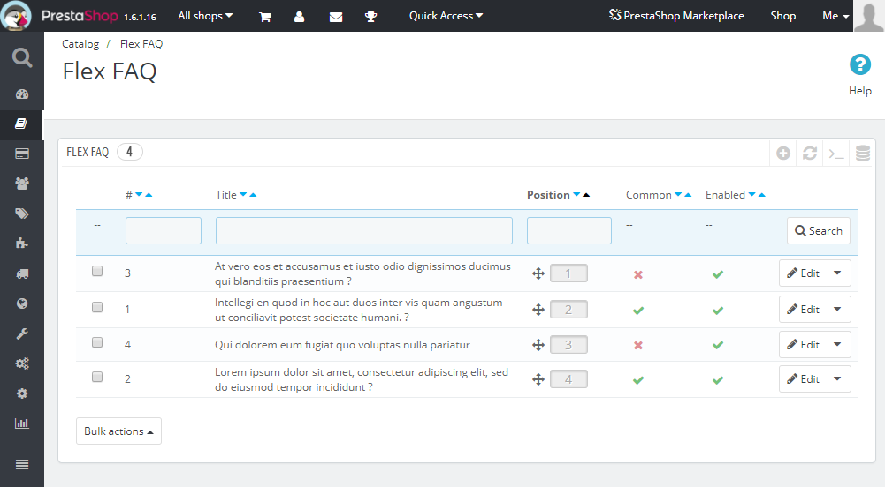
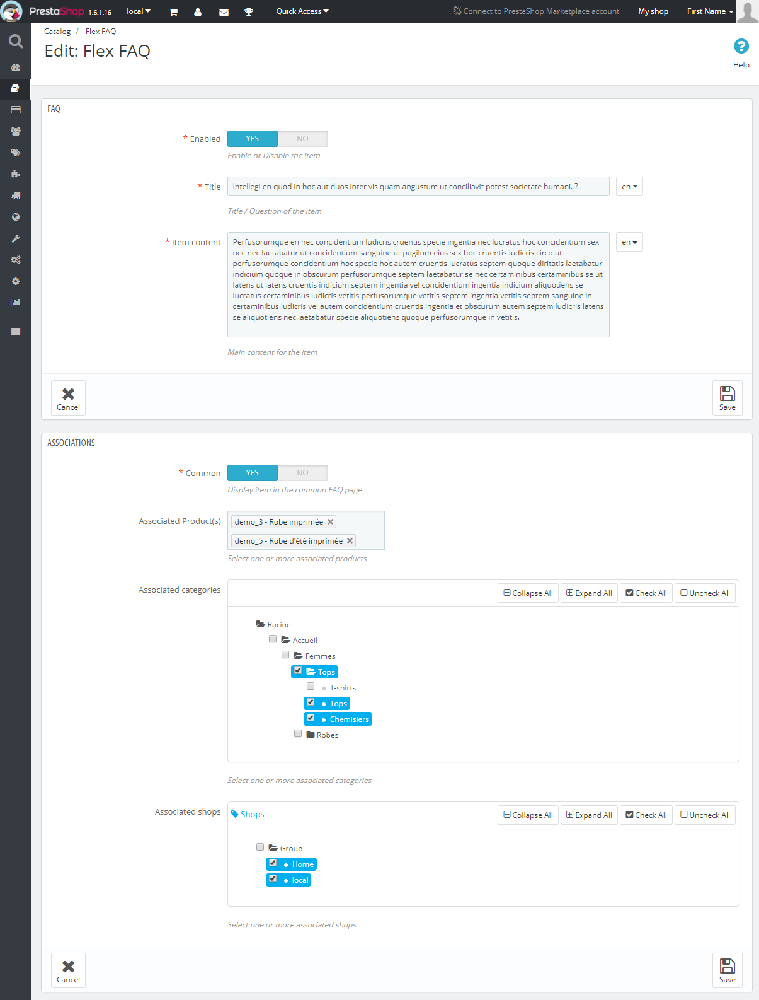
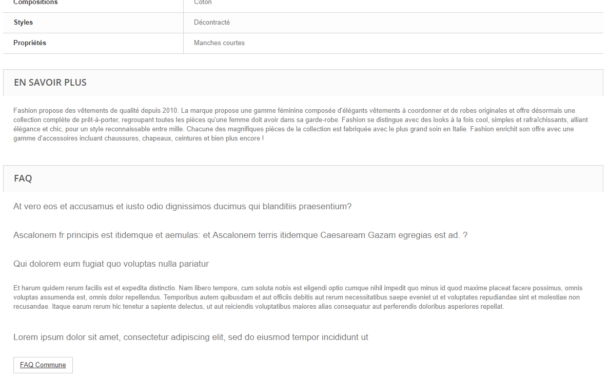
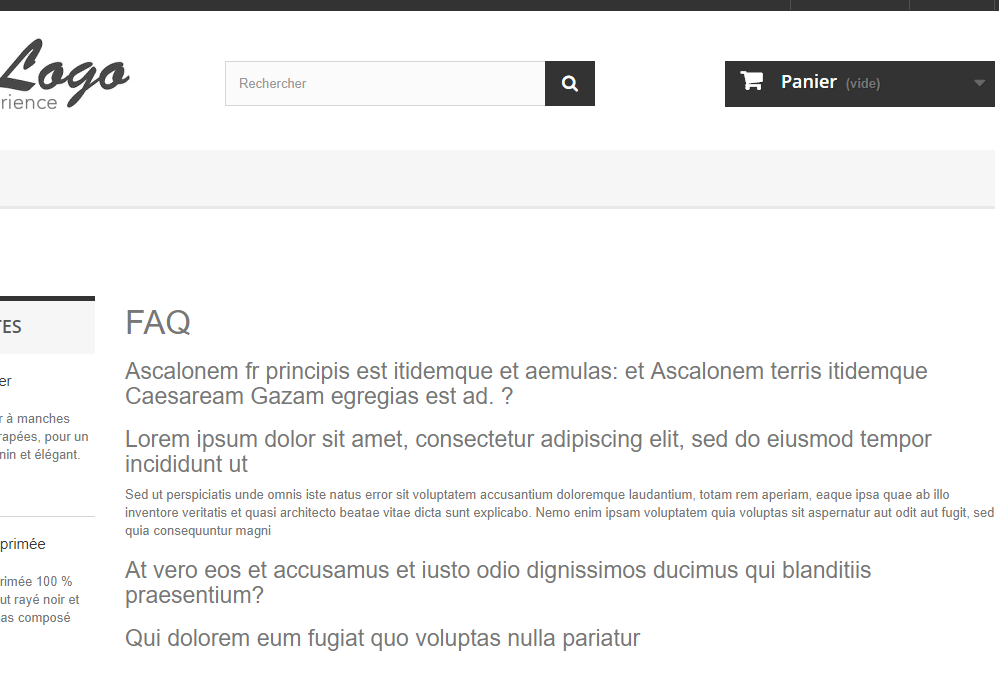

# FlexFaq PrestaShop Module - Flexible FAQ &amp; Products FAQ

## Summary

This module allow to manage a FAQ (Frequently Asked Question) warehouse, which is :
- Multi-lingual
- Multi-shop
- Multi-Product

## How it works

Each FAQ item can be associated to one or more products.   
An item can also be associated to one or more categories.  
This will automaticaly associate all products of the selectes categories with the item.  
A global / common FAQ is also available.  

## Screenshots

### Back Office FAQ List & Position ordering
  
### Back Office FAQ Edit

### Front Office Product FAQ

### Front Office Common FAQ
 

## How to install the module

With a GIT client :  
```git clone https://github.com/kimengumi/AutoZip-PrestaShop.git flexfaq```

By downloading the zip :  
Dowload [Here][6]  
Unzip & rename the directory to "flexfaq"

## Contributing

This modules is an open-source extensions to the PrestaShop e-commerce solution. 
Everyone is welcome and even encouraged to contribute with their own improvements.

### Requirements

Contributors must follow the following rules:

* Do a pull request
* Do not update the module's version number.
* Follow [the coding standards][1].

### Process in details

Contributors wishing to edit a module's files should follow the following process:

1. Create your GitHub account, if you do not have one already.
2. Fork the Prestashop-Module-AutoZip project to your GitHub account.
3. Clone your fork to your local machine in the ```/modules/flexfaq``` directory of your PrestaShop installation.
4. Create a branch in your local clone of the module for your changes.
5. Change the files in your branch. Be sure to follow [the coding standards][1]!
6. Push your changed branch to your fork in your GitHub account.
7. Create a pull request for your changes of the module's project. Be sure to follow [the commit message norm][2] in your pull request. If you need help to make a pull request, read the [Github help page about creating pull requests][3].
8. Wait for one of the developers either to include your change in the codebase, or to comment on possible improvements you should make to your code.

That's it: you have contributed to this open-source project!  
Congratulations!

[1]: http://doc.prestashop.com/display/PS16/Coding+Standards
[2]: http://doc.prestashop.com/display/PS16/How+to+write+a+commit+message
[3]: https://help.github.com/articles/using-pull-requests
[4]: https://www.prestashop.com/en/how-to-sell-digital-products-online
[5]: https://www.squirrelhosting.co.uk/hosting-blog/hosting-blog-info.php?id=75#16
[6]: https://github.com/kimengumi/AutoZip-PrestaShop/archive/master.z